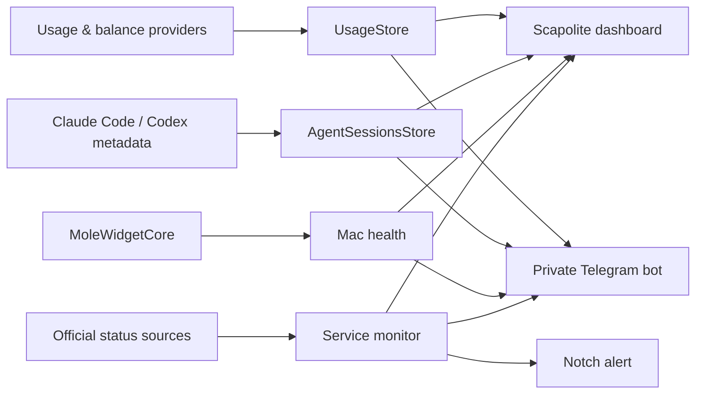

[English](README.md) · [Türkçe](docs/readme/README.tr.md) · [Русский](docs/readme/README.ru.md) · [Deutsch](docs/readme/README.de.md) · [Italiano](docs/readme/README.it.md) · [Français](docs/readme/README.fr.md) · [Español](docs/readme/README.es.md)

<p align="center">
  
</p>

<p align="center">
  <a href="https://github.com/taliyigit2-prog/Scapolite/actions"></a>
  
  
  <a href="LICENSE"></a>
</p>

<p align="center"><strong>AI limits, coding sessions, Mac health, and provider outages — without leaving your menu bar.</strong></p>

Scapolite is an open-source macOS menu bar cockpit built on the excellent foundations of [CodexBar](https://github.com/steipete/CodexBar). It keeps CodexBar's broad usage and balance support, then adds a unified dashboard for recent coding-agent sessions, live system metrics, independent AI service monitoring, notch alerts, and a private Telegram bot owned by each user.

> [!IMPORTANT]
> Scapolite currently ships as a source/ad-hoc build. The project does not yet have an Apple Developer ID, so downloads are not notarized and automatic Sparkle updates are deliberately disabled.

## One menu bar, six views

| View | What it gives you |
| --- | --- |
| **Usage** | Quota windows, resets, credits, spend, and pay-as-you-go balances from the provider catalog inherited from CodexBar. |
| **Spend** | Local cost history and reporting, separate from subscription quota. |
| **Sessions** | Recent **Claude Code** and **Codex CLI/Codex app** sessions, with one-click focus. Pi/OpenCode sessions remain available through the underlying session engine. |
| **System** | CPU, memory, disk, network, battery, temperature, health score, and top processes using `MoleWidgetCore`. |
| **Service Status** | A provider-independent operational view for OpenAI, Claude, Google AI Studio/Gemini API, Cursor, GitHub Copilot, and DeepSeek. |
| **Telegram** | Your own bot, your own chat, on-demand summaries, and outage/recovery notifications. No shared Scapolite group. |

Open the dashboard from the menu bar with **Open Scapolite Dashboard** or press <kbd>⌘</kbd><kbd>1</kbd>.

## Highlights

- Native Swift 6 / SwiftUI macOS app with a compact menu-bar-first workflow.
- Over 80 inherited usage providers and plugins, including credit and balance sources such as DeepSeek, OpenRouter, Mistral, DeepInfra, Moonshot, Venice, xAI, Vercel AI Gateway, and more.
- Up to three provider logos side by side, each with two small remaining percentages: session (top), weekly (bottom). Choose and reorder them in **Settings → Menu Bar**. GPT uses Codex quota, not ChatGPT web message limits.
- Claude's weekly row uses the overall plan limit, never a model-specific allowance. Antigravity uses the most constrained known model family per cadence; unavailable or different-length windows show a dash, not a fabricated percentage.
- Local Claude Code and Codex session discovery; it is opt-in because session metadata can include project names and paths.
- System telemetry sampled locally; no telemetry server is required.
- Independent outage polling every two minutes, even when the corresponding usage provider is disabled.
- Notch-aware overlay: red for a new disruption and green when a service recovers.
- Service alerts are enabled by default; disable them or trigger a single test in **Settings → Notifications** without disabling monitoring or Telegram.
- First status fetch establishes a baseline and never produces a false startup alert.
- Secure Telegram token storage in macOS Keychain, chat allow-listing, and long polling without a relay server.
- English, Turkish, Russian, German, Italian, French, and Spanish dashboard localization, alongside the wider inherited locale catalog.
- Five focused settings destinations: General, Notifications, Menu Bar, Advanced, and About. Provider settings remain intact; optional hooks and plugins live under Advanced.

### Provider documentation additions

The following provider pages are maintained by the provider registry generator:

<!-- Generated provider additions: Scripts/regenerate-provider-docs.mjs -->
- [LithosAI](docs/lithosai.md) — Chrome or manual console cookies for prepaid USD balance and optional UTC spend.
<!-- End generated provider additions -->

## Session scope

Scapolite discovers supported local agent processes and bounded metadata in their known session locations. Today the dashboard is designed for:

- **Claude Code** — the Anthropic command-line coding agent (often shortened to “CC”).
- **Codex CLI and the Codex desktop app** — local Codex sessions and rollout metadata.
- Existing Pi/OpenCode compatibility provided by the underlying CodexBar session model.
- Optional remote session discovery through the existing SSH/Tailscale configuration.

It does **not** import general claude.ai, chatgpt.com, or other cloud chat histories. Clicking a live session asks the existing session focuser to bring its terminal/app window forward; stale file-only entries may not have a window to focus.

## Service monitoring

Scapolite uses each vendor's public operational source and normalizes it into operational, maintenance, degraded, partial outage, and major outage states.

| Service | Source |
| --- | --- |
| OpenAI | [status.openai.com](https://status.openai.com/) |
| Claude | [status.claude.com](https://status.claude.com/) |
| Google AI Studio / Gemini API | [aistudio.google.com/status](https://aistudio.google.com/status) |
| Cursor | [status.cursor.com](https://status.cursor.com/) |
| GitHub Copilot | [copilot.statuspage.io](https://copilot.statuspage.io/) |
| DeepSeek | [status.deepseek.com](https://status.deepseek.com/) |

OpenAI, Claude, Cursor, and Copilot use their Statuspage-compatible summaries. DeepSeek uses its official RSS incident feed. Google AI Studio uses the public incident RPC used by its own status page and resolves the browser-restricted public key at runtime rather than embedding it.

## Telegram bot

Every user connects a bot they own:

1. Open Telegram and create a bot with [@BotFather](https://t.me/BotFather).
2. Send `/start` to the new bot from the chat that should receive alerts.
3. In **Scapolite Dashboard → Telegram**, paste the bot token.
4. Choose **Discover Chat ID**, then **Connect Bot** and **Send Test**.

Supported commands:

```text
/status    AI provider health
/usage     enabled provider quotas
/sessions  recent local/remote coding sessions
/system    current Mac health
/refresh   refresh provider status
/help      command list
```

Only the configured numeric chat ID is accepted. The bot token is stored in Keychain and is never written to logs or committed to the repository.

## Architecture



The internal Swift package target remains named `CodexBar` to preserve upstream compatibility, while the distributed bundle is `Scapolite.app` with bundle ID `com.taliyigit2.scapolite`.

## Build and run

Requirements:

- macOS 14 Sonoma or newer
- Xcode with Swift 6.2 or newer
- Git

```bash
git clone https://github.com/taliyigit2-prog/Scapolite.git
cd Scapolite
./Scripts/package_app.sh release
open Scapolite.app
```

The packaging script defaults to ad-hoc signing, disables the update feed, builds for the current Mac architecture, embeds the widget and resources, and verifies the resulting signature. To compile without packaging:

```bash
swift build
```

To run the full development loop:

```bash
./Scripts/compile_and_run.sh
```

> [!NOTE]
> A signed/notarized public release requires the project owner to add an Apple Developer ID certificate, notarization credentials, and a dedicated Sparkle EdDSA key. Upstream CodexBar signing identities and keys are intentionally not reused.

## Privacy and permissions

- Provider credentials stay on the Mac. Sources can include existing OAuth sessions, CLI credentials, API keys, opt-in browser cookies, and known local files.
- Session discovery is off by default and must be enabled by the user.
- Status checks contact only the official public endpoints listed above.
- Telegram talks directly from the Mac to `api.telegram.org`; Scapolite operates no intermediary bot service.
- Browser cookie import and some credential repair flows can trigger macOS Keychain prompts. Background paths fail softly rather than forcing authorization.
- Full Disk Access is optional and only needed for sources such as Safari cookies that macOS protects.

See [Keychain prompts](docs/keychain-prompts.md), [provider documentation](docs/providers.md), and [architecture notes](docs/architecture.md) for the inherited low-level details.

## Development quality gates

```bash
swiftformat Sources Tests
swiftlint --strict
make check
make test
```

Tests use fixtures, stubs, and no-UI Keychain seams. Live account probes and browser-cookie imports are not part of the normal automated suite.

## Credits and license

Scapolite exists because these projects made strong, reusable foundations available:

<a href="https://github.com/steipete/CodexBar"></a>

- [CodexBar](https://github.com/steipete/CodexBar) by Peter Steinberger and contributors — application foundation, provider catalog, usage UI, widgets, CLI, and session engine.
- [mole-widget](https://github.com/TadelUnso/mole-widget) by TadelUnso — consumed as the pinned `MoleWidgetCore` Swift package for system metrics.
- [Lunavect](https://github.com/lovach/Lunavect) — research reference for fast switching between coding-agent conversations; no character artwork is included in Scapolite.

The project is distributed under the [MIT License](LICENSE). Dependency notices remain available in [third-party licenses](docs/THIRD_PARTY_LICENSES.md).

## Contributing

Issues and focused pull requests are welcome. For provider work, begin with the [provider authoring guide](docs/provider.md). Please keep credentials out of fixtures, add focused tests for parsers and state transitions, and run the quality gates before opening a PR.

<p align="center"><sub>Scapolite: a small mineral, a broad cockpit.</sub></p>
